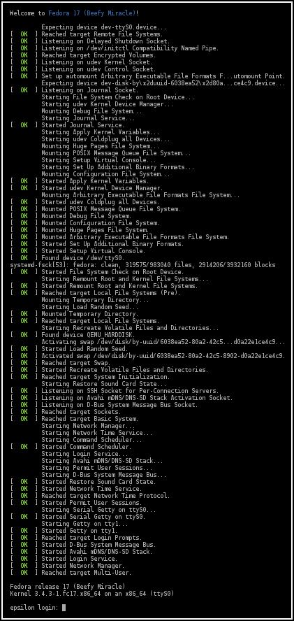

<!--
Multi-Monitor-Shortcuts:
Ctrl-O: Move Window to next screen
Mod4 + Control + j/k: Focus next/previous screen

reveal.js-Shortcuts:
o: Öffne Übersicht
s: Öffne Vortragsmonitor
-->

# Systemd
## System- und Servicemanager

**Tmux:** ssh tmux@turingmachine.ghcq.ml

**Live-Präsentation:** http://turingmachine.ghcq.ml/systemd-ta/

**Code:** https://github.com/Mic92/systemd-ta

Terminalmitschnitt folgt

Note:
- Thema: Systemd - System- und Servicemanager für Linux
- Nur lesbare Tmuxsession per SSH
- Codeschnipsel auf Github
- Kopierbarer Terminalmitschnitt später verlinkt


## Systemd - Ablauf
- kurze Einführung/Konzepte
- Praxisteil

Note:
- Bei Fragen: fragen
- Fragen:
  - Wer benutzt systemd irgendwo?
  - Wer hat Unit Files geschrieben


## Systemd - PID 1



Note:

- 1. Prozess nach dem Kernel gestartet -(init= Kernel-Parameter, /bin/init, /bin/bash)
- initialisiert System, startet Nicht-Betriebsystem-Dienste, Dateisysteme (/,
  /tmp, swap), Netzwerk, Zeit, Hostname, ...


## Systemd - Konzepte

- Units
- Abhängigkeiten
- Überwachung von Prozessen
- Beenden von Diensten
- minimale Bootzeit
- Debugbarkeit

Note:
- organisiert in Units anstatt nur Deamons/Dieste
- Abhängigkeiten zwischen Units (zirkuläre Abhängigkeiten werden aufgebrochen)
- Statt Start/Stop -> Überwachung von Prozessen
  -> Cgroups (cd /sys/fs/cgroup/systemd/)
  -> system.slice/user.slice/..., tasks
  -> faire Ressourcenverteilung (apache vs. mysql)
  -> systemd-cgls
- Systemd ordnet alle Prozesse zu ihren Diensten hinzu
  (Vorteil beim Beenden)
  $ ps xawf -eo pid,user,cgroup,args | less
- Start parallelisiert unter Berücksichtung von Abhängigkeiten (Desktop schnell,
  Server -> Container)
- Nachrichten beim Boot gehen nicht verloren, Ausgaben aller Programme in
  journald


## Systemd - Units

|                     |                   |
| --------------------| ------------------|
| **service.service** | **target.target** |
| **socket.socket**   | **path.path**     |
| **device.device**   | **timer.timer**   |
| **mount.mount**     | snapshot.snapshot |
| automount.automount | **slice.slice**   |
| swap.swap           | scope.scope       |

Note:
- Jede Unit eine Datei
- Endung -> Typ
- service: Daemons
- target:
  - vergleichbar runlevel, aber mehrere
  - zum Gruppieren von units
  - multi-user.target.wants, sleep.target.wants
- socket: Socket Activation
- device: Gerät, das von udev mit TAG+="systemd" getaggt wurde -> Service
  starten, wenn bestimmte Geräte angeschlossen werden
- mount: Systemd Generators -> parst fstab -> mount.targets -> sinnvoll als Abhängigkeit
- timer: Zeitevents -> Cron
- path: Änderungen im Dateisystem
- slice: Gruppieren von Diensten zur Resourcenverwaltung


## Systemd - Praxisteil

```bash
archlinux> systemctl --version
systemd 216
```

```bash
debian> systemctl --version
systemd 215
```

- Code: http://github.com/Mic92/systemd-ta

Note:
- falls gezeigte Beispiele nicht funktionieren -> systemd-Version überprüfen
- System-Units:
  - /usr/lib/systemd/system
  - /etc/systemd/system <-- Höhere Priorität
- pacman -Ql systemd | grep /usr/share/man | wc -l

<!--
[Service]
# keine Shell! -> Volle Pfade, Redirects oder Pipe werden NICHT unterstützt
ExecStart=/usr/bin/socat TCP-LISTEN:8888 'SYSTEM:echo Hello World'

host> systemctl start socat.service
host> systemctl status socat.service
● socat.service
   Loaded: loaded (/etc/systemd/system/socat.service; static) <- Pfad
   Active: active (running) since Sun 2014-10-26 10:40:41 CET; 1min 46s ago <- Startzeit, Laufzeit
 Main PID: 20362 (socat) <- Vaterprozess
   CGroup: /system.slice/socat.service
           └─20362 /usr/bin/socat TCP-LISTEN:8888 SYSTEM:echo Hello World <- Prozess
)
sudo ss -tlnp | grep -C3 8888
nc localhost 8888
host> systemctl status socat.service
vs.
host> systemctl status socat
-->

<!--
[Service]
ExecStart=/usr/bin/socat TCP-LISTEN:8888,reuseaddr 'SYSTEM:echo Hello World'
Restart=on-success # or always
-->

<!--
[Unit]
Description=Socat Greeting Service
Documentation=man:socat(1)

[Service]
ExecStart=/usr/bin/socat TCP-LISTEN:8888,reuseaddr 'SYSTEM:echo Hello World'
Restart=on-success # or always

[Install]
WantedBy=multi-user.target

host> systemctl enable socat
host> ls -la /etc/systemd/system/multi-user.target.wants/socat.service
host> systemctl status socat
host> sudo systemadm
-->

<!--
[Unit]
Description=Socat Greeting Service
Documentation=man:socat(1)

[Service]
ExecStart=/usr/bin/socat TCP-LISTEN:8888,reuseaddr 'SYSTEM:echo Hello World'
Restart=on-success # or always
User=nobody
Group=nobody

[Install]
WantedBy=multi-user.target
-->

<!--
host>cat /usr/local/bin/ifork
#!/usr/bin/python
import os, time, syslog

if os.fork() == 0:
   print("A new child ", os.getpid())
   while True:
        syslog.syslog("Spam the journal")
        time.sleep(1)
else:
   pids = (os.getpid(), newpid)
   print("parent: %d, child: %d" % pids)
   #time.sleep(3)
host> ps aux | grep 14651
host> journalctl -u ifork -f
host> cat /etc/systemd/system/ifork.service
[Service]
Type=forking
ExecStart=/usr/local/bin/ifork

[Install]
WantedBy=multi-user.target
host> systemctl start ifork
host> systemctl status ifork
time.sleep(5) -> parent
host> journalctl -u ifork -f
-->

<!--
host> cat /etc/systemd/system/network.service
[Unit]
Description=Network startup
Wants=network.target
Before=network.target

[Service]
Type=oneshot
RemainAfterExit=yes
EnvironmentFile=/etc/conf.d/network
ExecStart=/usr/bin/ip link set dev ${interface} up
ExecStart=/usr/bin/ip addr add ${address}/${netmask} dev ${interface}
ExecStart=/usr/bin/ip route add default via ${gateway} metric ${metric}

ExecStop=/usr/bin/ip addr flush dev ${interface}
ExecStop=/usr/bin/ip link set dev ${interface} down

[Install]
WantedBy=multi-user.target]

host> cat /etc/conf.d/network
interface=useless
address=192.168.1.2
netmask=24
gateway=192.168.1.1
metric=2048

# Zeigen: 1 Befehl schlägt fehl
-->

<!--
host> cat /etc/systemd/system/network.service
[Unit]
Description=Network startup
Wants=network.target
Before=network.target

[Service]
Type=oneshot
RemainAfterExit=yes
EnvironmentFile=/etc/conf.d/network@%i
ExecStart=/usr/bin/ip link set dev %i up
ExecStart=/usr/bin/ip addr add ${address}/${netmask} dev %i
ExecStart=/usr/bin/ip route add default via ${gateway} metric ${metric}
ExecStop=/usr/bin/ip addr flush dev %i
ExecStop=/usr/bin/ip link set dev %i down

[Install]
WantedBy=multi-user.target

host> cat /etc/conf.d/network@useless
address=192.168.1.2
netmask=24
gateway=192.168.1.1
metric=2048
-->

<!--
Andere Type ->
notify:
  - /usr/lib/systemd/system/systemd-networkd.service
  - capabilities
  - ProtectSystem -> /usr | /etc read-only
  - ProtectHome -> /home /run/usr ohne Zugriff
  - SystemCallFilter
  - PrivateTmp=
dbus:
  - /usr/lib/systemd/system/dnsmasq.service
-->

<!--
Cgroup Limits
cat /etc/systemd/system/forkbomb.service
[Service]
MemoryLimit=30M
CPUQuota=20%
OOMScoreAdjust=1000
ExecStart=/usr/bin/perl -e "fork while 1"

systemd-cgtop
-->

<!--
systemctl show mongodb
systemctl set-property --runtime mongodb.service "MemoryLimit=100M"
systemctl set-property mongodb "MemoryLimit=100M"
systemctl show mongodb | grep Memory
systemctl status mongodb
systemd-delta
systemd-delta /etc
-->

<!--
- Automatisch Komprimiert und Rotiert (Ringbuffer)
- Syslog, Stdout, dmesg, journal, remote
- indiziert
- Persistent in /var/log/journal sonst /run/log/journal
$ journalctl --file
$ journalctl -u <UNIT>
$ journalctl -u <UNIT> -n 100
$ journalctl -u <UNIT> -f
$ systemd-cat -t "mydaemon"
$ journalctl -o verbose -u sshd
$ journalctl \_EXE=/usr/bin/sshd
$ journalctl -o json -u sshd
$ journalctl --list-boots
$ journalctl -u sshd --since="-3 hours"
$ journalctl -p crit
-->

<!--
$ systemctl
$ systemctl --state failed
-->

<!--
virtualbox
nc -U /tmp/virtualbox-socket
2mal runter: systemd.confirm_spawn=1
3mal runter: systemd.unit=single
4mal runter: debug systemd.log_target=console console=ttyS0
-->

<!--
host> pacstrap -d arch base vim git htop dnsutils
host> tree ~/arch
host> systemd-nspawn -D ~/arch
host> systemd-nspawn -D ~/arch -b

- systemd/user -> logind


host> mkdir -p .config/systemd/user
host> cat .config/systemd/user/backup.service
[Unit]
Description=Perform backup
RequiresMountsFor=/mnt/hdd/backup
ConditionACPower=true

[Service]
Nice=19
IOSchedulingClass=best-effort
IOSchedulingPriority=7

ExecStart=/usr/bin/env rsync -rv '%h/git' '/mnt/hdd/backup'
host> systemctl --user start backup
host> systemctl --user status backup
host> cat .config/systemd/user/backup.timer
[Unit]
Description=Run backup

[Timer]
OnBootSec=10min
OnUnitActiveSec=1 week

[Install]
WantedBy=default.target
host> rm -r /mnt/hdd/backup/git
host> systemctl --user start backup.timer
host> systemctl --user status backup.timer
host> systemctl --user status backup.service
host> systemctl --user list-timers
host> systemctl list-timers

- Jobs can be easily started independently of their timers. This simplifies debugging.
- Each job can be configured to run in a specific environment (see the systemd.exec(5) man page).
- Jobs can be attached to cgroups.
- Jobs can be set up to depend on other systemd units.
- Jobs are logged in the systemd journal for easy debugging.
-->

<!--
host> cat .config/systemd/user/backup.timer
[Unit]
Description=Run backup

[Timer]
OnCalendar=daily
#OnCalendar=05:40

#OnCalendar=Thu,Fri 2012-*-1,5 11:12:13
#The above refers to 11:12:13 of the first or fifth day of any month of
#the year 2012, given that it is a Thursday or Friday.

# -> man systemd.time

[Install]
WantedBy=default.target]
host> systemctl --user daemon-reload
host> systemctl --user restart backup.timer
host> systemctl --user status backup.timer
-->

<!--
host> cat .config/systemd/user/backup.timer
[Unit]
Description=Run backup

[Timer]
OnCalendar=daily
Persistent=true
#WakeSystem=true

[Install]
WantedBy=default.target
-> /var/lib/systemd/timers
-->

<!--
host> debootstrap --variant=buildd --include=vim,locales,htop,git,curl,dnsutils,openssh-server testing ~/debian
host> tree ~/debian
host> systemd-nspawn -D ~/debian
$ passwd
$ dpkg-reconfigure locales
host> systemd-nspawn -D ~/debian -b
$ machinectl -a show debian
$ machinectl login debian
$ nsenter --target <PID> --mount --uts --ipc --net --pid /bin/bash --login
$ apt-get install dbus  # logind
$ # restart
$ systemd-nspawn -D debian --network-veth
$ systemd-nspawn -D debian --private-network
$ ip a
host> ip a
-->
